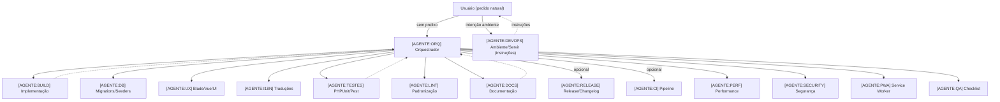

MCP do Projeto BuyPeer (Cursor)

Resumo
- Este documento descreve como o sistema de agentes do Cursor (MCP) está configurado para o BuyPeer, cobrindo: papéis dos agentes, roteamento por intenção, políticas, exemplos de uso e como portar essas regras para outros projetos.

Componentes
- Arquivos:
  - `cursorrules`: regras de orquestração e agentes (fonte principal destas instruções)
  - `.cursor/mcp.json`: configuração de servidores MCP externos (ex.: `context7`)
- Principais agentes:
  - [AGENTE:ORQ] (Orquestrador)
  - [AGENTE:DEVOPS] (Ambiente local/CI e servir aplicação — apenas instruções)
  - [AGENTE:ARCH] (Arquitetura e dono da documentação técnica)
  - [AGENTE:BUILD] (Implementação Laravel/Vue)
  - [AGENTE:TESTES] (Testes)
  - [AGENTE:DOCS] (Escrita/edição de docs sob diretrizes do ARQUITETO)
  - [AGENTE:LINT], [AGENTE:DB], [AGENTE:UX], [AGENTE:I18N], [AGENTE:SECURITY], [AGENTE:PERF], [AGENTE:PWA], [AGENTE:RELEASE], [AGENTE:CI], [AGENTE:DATAFIX], [AGENTE:QA]

Roteamento por Intenção (resumo)
- Sem prefixo -> [AGENTE:ORQ]
- "subir servidor", "rodar local", "abrir no navegador", "iniciar laravel", "servir", "abrir admin" -> [AGENTE:DEVOPS]
- "build", "compilar assets", "otimizar bundle" -> [AGENTE:BUILD]
- "migrar", "seedar", "popular banco" -> [AGENTE:DB]
- "testar", "rodar testes" -> [AGENTE:TESTES]
- "documentar", "atualizar docs" -> [AGENTE:ARCH]

Políticas-chave
- Não versionar artefatos de build (`public/js`, `public/css`, `public/build`, `*.map`, `storage/*.log`).
- Em Blade usar `mix()`; em produção usar `mix.version()` (cache bust).
- Em desenvolvimento, evitar habilitar Service Worker; em produção, versionar caches e limpar com segurança.
- Seeders idempotentes; evitar MassAssignmentException com `fillable/guarded`.
- Manter comunicação, commits e documentação em pt-BR conciso.

Fluxo padrão do Orquestrador
1) Ler `docs/contexto.md` e `docs/plan/tasks.md`
2) Definir plano mínimo e subagentes necessários
3) Delegar implementação (BUILD/DB/UX/I18N)
4) Delegar testes (TESTES)
5) Lint (LINT)
6) Documentação (ARCH coordena + DOCS escreve)
7) Opcional: Release (RELEASE/CI)

Como pedir (exemplos)
- Natural (ORQ): "Analisar o front e ajustar montagem do SPA, entregar testado e pronto para produção."
- DEVOPS: "Subir local em 127.0.0.3:8000; instruir sem executar; validar /, /health, /admin."
- BUILD: "Refatorar `resources/js/app.js` para montagem resiliente (#admin-app/#site-app/#app)."
- TESTES: "Criar testes para `app/Services/ProductService.php::flashSaleProducts()`."
- ARQUITETO: "Atualizar `docs/contexto.md` com decisões do tema e tokens."

Diagrama (Mermaid)

Portabilidade para outros projetos
1) Copie `cursorrules` para a raiz do novo repositório e ajuste:
   - Stack, mount points, políticas específicas (SW, mix/version).
   - Roteamento por intenção (palavras-chave do seu domínio).
   - Lista de agentes realmente necessários no projeto.
2) Crie `docs/contexto.md` e `docs/plan/tasks.md` mínimos para dar contexto aos agentes.
3) Opcional: ajuste `.cursor/mcp.json` para servidores MCP externos usados.
4) Valide com um pedido simples ao ORQ e outro ao DEVOPS.

Boas práticas
- Sempre delimite escopo e paths antes de pedir mudanças grandes.
- Prefira mudanças atômicas e revisáveis; mantenha a indentação original.
- Em dev, evite SW; use `mix.version()` e limpeza de caches para mitigar assets antigos.
- Não comitar artefatos gerados; mantenha `.gitignore` atualizado.

Anexos
- `cursorrules` (versão atual) é a referência principal. Qualquer mudança de política deve atualizar este documento.

